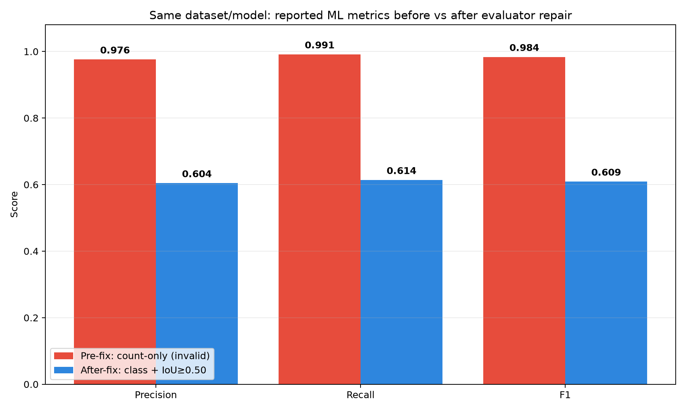
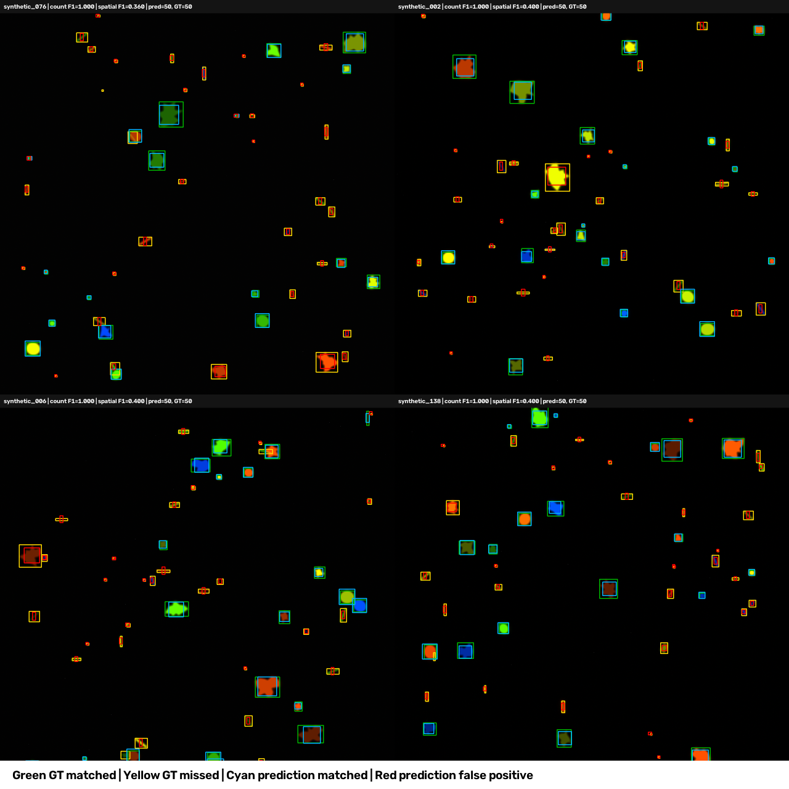
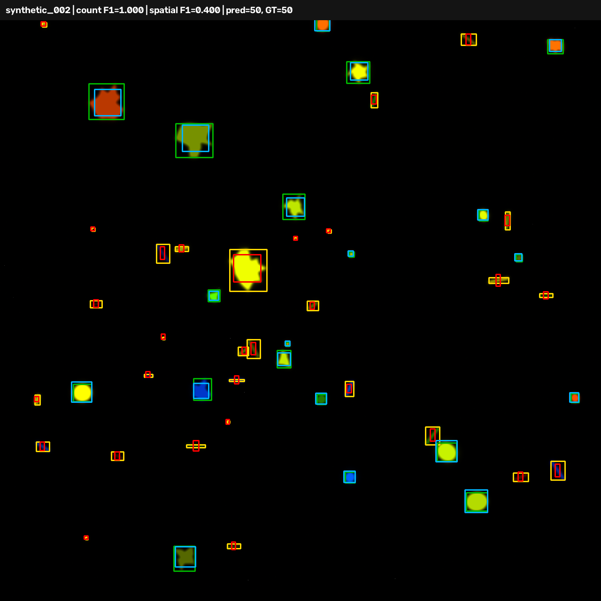
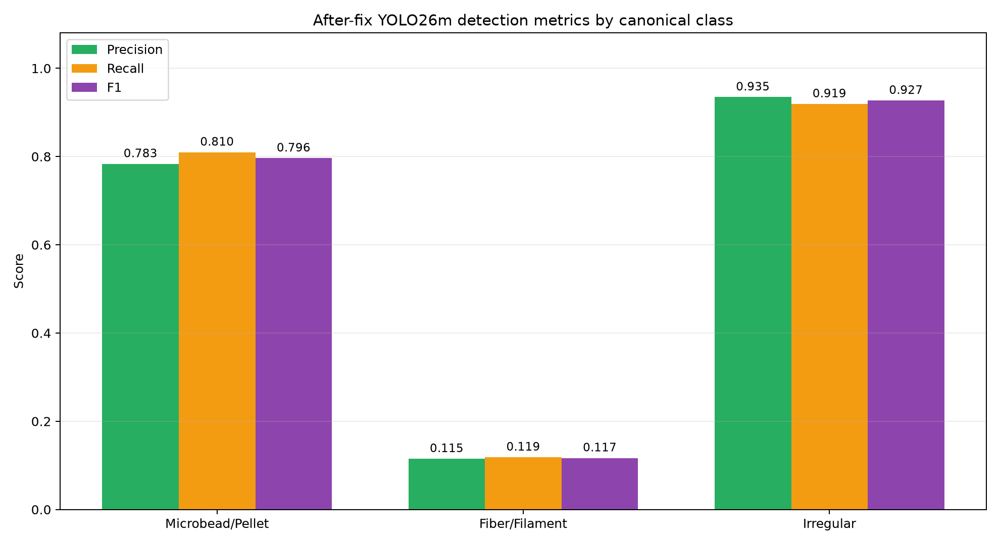

# Đánh giá benchmark trước và sau khi sửa

## 1. Kết luận ngắn để trình bày

Benchmark cũ báo cáo YOLO26m có **F1 = 0,9837**, nhưng công thức cũ chỉ so số lượng prediction và Ground Truth (GT) trên mỗi ảnh. Prediction sai vị trí hoặc sai class vẫn có thể bị tính là true positive.

Sau khi sửa, benchmark ghép từng prediction với tối đa một GT cùng class, theo thứ tự confidence giảm dần và yêu cầu **IoU ≥ 0,50**. Trên cùng dataset, model, confidence và số prediction, F1 hợp lệ của ML là **0,6090**.

| Metric ML | Trước sửa: count-only | Sau sửa: class + IoU | Chênh lệch |
|---|---:|---:|---:|
| TP | 9.914 | 6.138 | −3.776 |
| FP | 243 | 4.019 | +3.776 |
| FN | 86 | 3.862 | +3.776 |
| Precision | 0,9761 | 0,6043 | −0,3718 |
| Recall | 0,9914 | 0,6138 | −0,3776 |
| F1 | **0,9837** | **0,6090** | **−0,3747** |

F1 giảm **37,47 điểm phần trăm** không có nghĩa model vừa bị làm kém đi. Model không được train hoặc fine-tune trong thí nghiệm này; benchmark mới chỉ đo đúng hơn các lỗi vị trí, kích thước bbox, duplicate và sai class mà công thức cũ che khuất.



## 2. Điều kiện kiểm soát phép so sánh

| Thành phần | Giá trị được khóa |
|---|---|
| Dataset | `benchmark_results/dataset/20260824` |
| Số ảnh / file GT | 200 / 200 |
| Tổng object GT có bbox hợp lệ | 10.000 |
| Microbead/Pellet | 3.302 |
| Fiber/Filament | 3.364 |
| Irregular (gồm Fragment) | 3.334 |
| Dataset manifest SHA-256 | `d5d55d44aa9a8cff6f39a292a7f99e186887a15b8c0c5ac300399b8e5f4d5a23` |
| Model | `src/ml/Yolo26m/best.pt` |
| Model SHA-256 | `c308593934437df75a9ea34ef0a6cca11337fcbe66159b2293d295be9807da5c` |
| Confidence threshold | 0,25 |
| IoU threshold sau sửa | 0,50 |
| Raw YOLO prediction | 10.157 |

Runner đã kiểm tra hash dataset, model và baseline trước/sau khi chạy. Sidecar xác nhận đủ 200 image record, 200 ML lineage record và metric spatial ở trạng thái `available=true`.

Baseline HTML cũ không lưu prediction sidecar nên không thể phát lại đúng inference `001406`. Vì vậy after-fix là một inference mới nhưng sử dụng đúng dataset, model và confidence. Tính ổn định được kiểm tra thêm vì count-only trên snapshot mới tái tạo đúng P/R/F1 chưa làm tròn của baseline cũ.

## 3. Benchmark cũ sai ở đâu

### 3.1 Công thức count-only giả lập TP

Code cũ sử dụng ý tưởng:

```python
tp = min(detected, ground_truth)
fp = max(0, detected - ground_truth)
fn = max(0, ground_truth - detected)
```

Nó không đọc quan hệ không gian giữa các bbox. Nếu một ảnh có 50 prediction và 50 GT thì công thức cho TP=50, FP=0, FN=0, bất kể prediction nằm ở đâu.

Evidence trực quan dưới đây gồm bốn ảnh đều có 50 prediction và 50 GT. Count-only cho F1=1,000, trong khi matching bbox trước sửa chỉ tìm được 18–20 TP mỗi ảnh.



Quy ước overlay: xanh lá là GT đã match, vàng là GT bị bỏ sót, cyan là prediction đã match và đỏ là false positive.



### 3.2 Report trộn class YOLO với morphology hậu xử lý

Model chỉ có ba class, nhưng report cũ lấy `feature['shape']` từ ShapeAnalyzer chạy lại trong ROI. Vì vậy biểu đồ ML từng xuất hiện cả `Fragment` và `Irregular`, không còn cùng ontology với output YOLO.

Sau sửa:

- metric detection và phân bố class ML lấy từ raw YOLO prediction;
- `Fragment` của GT/heuristic được chuẩn hóa thành `Irregular` trong ontology benchmark;
- morphology hậu xử lý không còn được trình bày như class output của model.

### 3.3 Color và area từng dễ bị diễn giải sai

YOLO26m không dự đoán màu. Màu là kết quả ColorAnalyzer chạy trong ROI. Report cũ bỏ `Unknown/Other`, làm tổng cột màu ML nhỏ hơn nhiều tổng prediction nhưng không giải thích coverage.

Sau sửa, report gọi đúng đây là **ROI color post-processing**, giữ `Unknown`, và lưu `color_coverage`. Area chart được ghi là phân bố mô tả chưa matching; không được dùng histogram này để kết luận sai số area trên từng object.

### 3.4 Số trung bình từng bị cắt xuống số nguyên

10.157 / 200 = **50,785 prediction/ảnh**, nhưng report cũ hiển thị `50`. Sau sửa payload giữ số thực và đồng thời lưu `detected_total=10157`.

### 3.5 Baseline cũ không đủ provenance để replay

HTML `001406` không chứa raw bbox, thứ tự input, hash model/dataset hoặc cấu hình evaluator. Sau sửa, mỗi report có file `.benchmark.json` chứa:

- hash HTML, model và từng input/GT;
- input order;
- confidence và IoU threshold;
- GT đã parse;
- raw YOLO prediction, feature hậu xử lý và prediction bị loại;
- kết quả matching theo ảnh và theo class;
- count-only được giữ với nhãn `diagnostic_only`, không còn là metric chất lượng.

## 4. Chính xác benchmark đã được sửa như thế nào

1. Parse và kiểm tra bbox GT ở định dạng pixel `xywh`; bbox rỗng, âm, vượt ảnh hoặc class không hỗ trợ làm benchmark fail rõ ràng.
2. Chuẩn hóa ontology thành ba class: `Microbead/Pellet`, `Fiber/Filament`, `Irregular`.
3. Với từng ảnh, sort prediction theo confidence giảm dần, ổn định theo index ban đầu.
4. Một prediction chỉ ghép với GT chưa được dùng, cùng class, có IoU lớn nhất và IoU ≥ 0,50.
5. Prediction không match là FP; GT không match là FN; aggregate TP/FP/FN toàn dataset rồi mới tính micro Precision/Recall/F1.
6. Báo cáo thêm metric theo từng class và mô tả rõ evaluation contract.
7. Nếu GT không có bbox đầy đủ, metric trả `available=false` và report hiển thị `N/A`; không tự thay bằng count agreement.
8. Persist report và snapshot evidence nguyên tử; report không được xem là baseline replayable nếu sidecar thất bại.

Các test tự động bao phủ perfect match, sai vị trí, sai class, duplicate, tập rỗng, parser GT, bbox không hợp lệ, trạng thái unavailable, single-inference lineage và report `N/A`.

## 5. Kết quả sau sửa theo class

| Class | GT | Prediction | TP | FP | FN | Precision | Recall | F1 |
|---|---:|---:|---:|---:|---:|---:|---:|---:|
| Microbead/Pellet | 3.302 | 3.413 | 2.674 | 739 | 628 | 0,7835 | 0,8098 | **0,7964** |
| Fiber/Filament | 3.364 | 3.465 | 399 | 3.066 | 2.965 | 0,1152 | 0,1186 | **0,1169** |
| Irregular | 3.334 | 3.279 | 3.065 | 214 | 269 | 0,9347 | 0,9193 | **0,9270** |



Điểm quan trọng nhất là tổng prediction của Fiber/Filament (3.465) rất gần tổng GT (3.364), nhưng chỉ 399 prediction match đúng class và IoU. Đây là ví dụ rõ nhất cho việc **phân bố tổng gần đúng không đồng nghĩa detection đúng object**.

## 6. Vì sao F1 after-fix 0,609 khác audit độc lập 0,526 trước đó

Hai kết quả đều yêu cầu cùng class, một-một và IoU ≥ 0,50 nhưng dùng thứ tự greedy khác nhau:

- Audit độc lập trước sửa: ưu tiên cặp có IoU lớn nhất toàn ảnh, cho F1=0,5257.
- Production after-fix: ưu tiên prediction theo confidence giảm dần rồi chọn GT có IoU lớn nhất, cho F1=0,6090.

Trong ảnh đông hoặc bbox chồng lấn, cặp được chọn trước làm thay đổi GT còn lại, nên tổng TP có thể khác. Production policy được chọn vì đây là cách đánh giá detection theo ranking confidence và được khóa rõ trong sidecar. Không được trộn hai con số trong cùng một bảng mà không ghi policy.

## 7. Điều có thể và không thể kết luận

Có thể kết luận:

- F1=0,984 của benchmark cũ bị thổi phồng và không phải spatial object-detection F1.
- Benchmark sau sửa phản ánh lỗi localization/class tốt hơn và có thể audit lại.
- Fiber/Filament là class yếu nhất, cần điều tra annotation, hình dạng bbox và model.

Chưa thể kết luận:

- Model vừa giảm chất lượng 37,47 điểm: model không thay đổi, evaluator thay đổi.
- Fine-tuning chắc chắn là bước tiếp theo: trước tiên cần audit Fiber bbox/annotation và failure cases.
- Area/color của model kém chỉ từ các histogram: đây là hậu xử lý và chưa phải metric matching theo object.
- Hai run có timing so sánh công bằng: lần chạy không được thiết kế như benchmark hiệu năng có warm-up/repetition.

## 8. Artifacts chính thức

| Artifact | Mục đích |
|---|---|
| `benchmark_results/ml_benchmark_200images_20260825_001406.html` | Baseline HTML trước sửa |
| `benchmark_results/evidence/pre_fix_20260825_001406/audit_summary.json` | Số liệu/evidence audit lỗi công thức cũ |
| `benchmark_results/evidence/pre_fix_20260825_001406/spatial_failure_contact_sheet.png` | Evidence trực quan count đúng nhưng bbox sai |
| `benchmark_results/evidence/after_fix_20260825_231305/after_fix_final.html` | Report final sau sửa |
| `benchmark_results/evidence/after_fix_20260825_231305/after_fix_final.benchmark.json` | Snapshot replay/audit 200 ảnh, có manifest hash |
| `benchmark_results/evidence/after_fix_20260825_231305/run_record.json` | Seal, invariant và metric tổng hợp |
| `benchmark_results/evidence/after_fix_20260825_231305/final_validation.json` | Kiểm tra thứ tự manifest, hash và disclosure trong report |
| `benchmark_results/evidence/after_fix_20260825_231305/before_after_comparison.json` | So sánh có máy đọc được |

## 9. Trạng thái

- [x] Khóa và kiểm tra dataset 200 ảnh, 10.000 GT bbox.
- [x] Lưu evidence chứng minh metric cũ sai.
- [x] Sửa evaluator thành matching class-aware one-to-one IoU.
- [x] Sửa ontology, report và snapshot evidence.
- [x] Chạy after-fix trên cùng dataset/model/confidence.
- [x] Kiểm tra 14/14 unit/integration test, compileall và system-info.
- [x] Tạo bảng và hình ảnh so sánh trước–sau.
- [ ] Audit chi tiết Fiber/Filament trước khi quyết định fine-tuning.

**Điểm dừng hiện tại:** mục tiêu so sánh benchmark trước và sau sửa đã hoàn thành. Bước tiếp theo hợp lý là phân tích failure case Fiber/Filament trên các cặp FP/FN đã lưu, không phải sửa evaluator thêm để làm điểm cao hơn.
