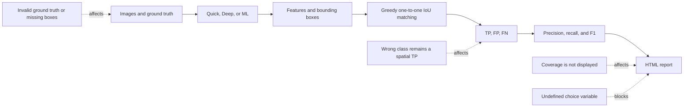

## Current status

| Area | Status | Summary |
|---|---|---|
| Single-image benchmark workflow | Partially ready | Runs, but the report records the wrong image count and metrics remain limited |
| Batch benchmark workflow | Not ready | An undeclared variable prevents report creation |
| IoU formula | Ready | Correct for boxes represented as `x, y, width, height` |
| Precision, recall, and F1 formulas | Conditionally ready | Correct for the current TP/FP/FN values, but TP identification may be wrong |
| Class-aware detection | Not ready | Wrong-class predictions can still count as localization TP |
| Metric coverage | Not ready | The report does not disclose how many images contributed to a metric |
| Ground-truth integrity | Not ready | Invalid files may be interpreted as valid empty annotations |
| Train/test independence | Uncontrolled | The GUI accepts arbitrary folders and does not record a dataset version |
| Synthetic benchmark | Partially ready | Reproducible by seed, but not fully representative of real images |
| Timing benchmark | Not ready | One pass, no warm-up, and no confirmation of the actual execution device |
| Unit tests | Partially ready | 14 tests pass, but report and GUI integration coverage is missing |
| ML runtime | Unverified | The reviewed environment did not have compatible PyTorch and Ultralytics packages |

### Overall verdict

**Status: NOT READY FOR MODEL DECISION**

The benchmark can identify development regressions or support internal trend analysis. It cannot yet answer these questions reliably:

- Does the model actually detect particles better than Quick and Deep analysis?
- Which model performs best on real microscope images?
- Do the current precision, recall, and F1 values represent the complete dataset?
- Does the model classify the microplastic type correctly, or only localize a particle?
- Is the model faster than traditional methods under fair conditions?

## Current benchmark workflow



The final formulas may be mathematically correct while the result remains wrong. If the ground truth, matching policy, or input set is invalid, precision and recall are calculated correctly from incorrect TP, FP, and FN values.

## Which metrics are correct, and what do they mean?

### IoU

The formula in `src/analysis/detection_metrics.py:22-33` is correct for bounding boxes in `(x, y, width, height)` format:

```text
IoU = intersection area / union area
```

The result is valid only when:

- Predictions and ground truth use the same pixel coordinate system.
- Both use `xywh`; neither is mistakenly treated as `xyxy`.
- Width and height are positive.
- Any image resizing is reversed correctly before comparison.

### TP, FP, and FN

The reviewed code defines a spatial match as a TP when IoU is at least the configured threshold, which defaults to 0.5. Each prediction and each GT object can be used only once.

That definition is valid for **class-agnostic localization**. It answers, “Did the model place a box on the correct particle?” It does not answer, “Did the model place the correct box and predict the correct particle type?”

### Precision, recall, and F1

The formulas are correct:

```text
precision = TP / (TP + FP)
recall    = TP / (TP + FN)
F1        = 2 * precision * recall / (precision + recall)
```

Batch evaluation aggregates TP, FP, and FN before calculating the ratios. This is a micro-average, appropriate when every particle should have equal weight. The report does not clearly identify it as a micro-average or accurately disclose which images contributed.

### Class accuracy

`class_accuracy` is calculated as:

```text
class_accuracy = same-class spatial matches / all spatial matches
```

It describes classification only **after a box has matched**. It excludes missed GT objects and excess predictions, so it must not be presented as overall model accuracy.

### Missing metrics

The benchmark does not yet calculate several common object-detector metrics:

- Class-aware precision, recall, and F1.
- Precision-recall curves across confidence thresholds.
- AP50 and AP50–95.
- Per-class AP and recall.
- Metrics by particle size.
- Confidence calibration.
- Confidence intervals or run-to-run variation.

## Issue summary and likely bias

| ID | Severity | Issue | Primary distortion |
|---|---|---|---|
| B-01 | P0 | `choice` is undeclared | Batch report is not created |
| B-02 | P0 | GUI reports completion after failure | A failed run appears successful |
| B-03 | P1 | Invalid GT is treated as valid | FP is inflated and precision is understated |
| B-04 | P1 | Metric coverage is undisclosed | Subset metrics appear to represent the full dataset |
| B-05 | P1 | Declared count differs from parsed records | Recall and total GT use different denominators |
| B-06 | P1 | Timing protocol is unfair | Speed ranking is unreliable |
| B-07 | P1 | YOLO and heuristic labels are mixed | Two ML outputs measure different components |
| B-08 | P1 | Synthetic labels differ from the visible footprint | IoU depends on an undocumented box definition |
| B-09 | P2 | Single-image report defaults to zero images | Report misstates its scope |
| B-10 | P1 | Greedy matching can miss valid TP | Precision, recall, and F1 may be understated |
| B-11 | P1 | Only one operating point is measured | Insufficient for general model comparison |
| B-12 | P1 | Integration tests are missing | Module-wiring defects escape tests |
| B-13 | P1 | Wrong-class matches count as spatial TP | Detection performance may be overstated |
| B-14 | P1 | Train/validation/test independence is uncontrolled | Results may overstate generalization |

## B-01 Batch report creation fails because of an undeclared variable

### Current behavior

Both batch workflows use `choice.startswith('Generate')` when creating the `synthetic_generation` field. In the same functions, the dialog value is stored in `item`. No local or global variable named `choice` exists.

### Evidence

- `src/gui/main_window.py:2907`
- `src/gui/main_window.py:5336`
- A file-wide search finds `choice` only in these two expressions.
- Python detects this defect only when report creation executes, so `compileall` may still pass.

### Impact

- Every image may finish processing before the exception occurs.
- A new HTML file is not created.
- Metadata, model hash, and benchmark configuration are not preserved in the final artifact.
- A user may open an older report and mistake it for the latest result.
- Batch reports cannot be used reliably for run-to-run comparison.

### Detailed repair

1. Do not derive report state from GUI display strings.
2. Immediately normalize the selected source:

   ```python
   source_mode = "synthetic" if "Generate" in item else "folder"
   synthetic_params = None
   ```

3. For synthetic data, capture configuration outside any loop variable:

   ```python
   synthetic_params = vars(params).copy()
   synthetic_params["seed_policy"] = "benchmark_base_seed_plus_image_index"
   ```

4. Build the payload from normalized values:

   ```python
   "source_mode": source_mode,
   "synthetic_generation": synthetic_params,
   ```

5. Use one helper for standard and ML benchmarks to prevent a one-sided repair.
6. Test both synthetic and folder modes through HTML creation.

### Acceptance criteria

- Both batch modes create a new HTML file.
- Folder payloads contain `synthetic_generation = null`.
- Synthetic payloads retain configuration and seed policy.
- No references to `choice` remain.

## B-02 Completion status does not reflect report failure

### Current behavior

HTML-generation exceptions are caught and displayed, but the GUI later sets progress to complete and shows a benchmark-complete message.

### Evidence

- `src/gui/main_window.py:2932-2938`
- `src/gui/main_window.py:5361-5369`
- The single-image flow behaves similarly at `src/gui/main_window.py:2227-2235`.

### Impact

- GUI status cannot prove a successful benchmark.
- Operators cannot clearly distinguish analysis failure from report failure.
- Manual or scripted checks may record a false success.
- A P0 failure is reduced to a visual warning.

### Detailed repair

1. Track `analysis_completed`, `report_completed`, and `report_path` explicitly.
2. Show `Benchmark complete` only when analysis and reporting both succeed.
3. On report failure, show `Benchmark analysis completed, report failed`.
4. Do not open a browser unless the output file exists and is non-empty.
5. Return a structured result:

   ```python
   BenchmarkRunStatus(
       analysis_ok=True,
       report_ok=False,
       report_path=None,
       error_message=str(error),
   )
   ```

6. Log the exception and retain a technical stack trace.

### Acceptance criteria

- Report failure produces an explicit failed status.
- “Complete” never appears when report creation fails.
- The file exists and is readable before success is shown.

## B-03 Invalid ground truth can be treated as an empty annotation

### Current behavior

When loading an image folder, `has_ground_truth` depends only on annotation-path existence. If parsing fails, `ground_truth_data` can be empty while the image remains marked as annotated.

### Evidence

- `src/gui/main_window.py:2514-2524`
- `src/gui/main_window.py:5056-5065`
- `src/data_generation/ground_truth_io.py:14-82` returns counts and particles but not a validation state.
- `evaluate_image_detections()` treats an empty GT list with `annotated=True` as a valid negative image.

### Impact

If a file contains particles but parsing returns an empty list, every prediction becomes an FP. Precision falls because of annotation failure, not model error.

```text
Actual image: 10 particles
Parser failure: ground_truth = []
Model: 9 correct predictions
Possible benchmark result: TP=0, FP=9
```

### Detailed repair

1. Replace separate count and boolean fields with a structured parse result:

   ```python
   @dataclass
   class GroundTruthLoadResult:
       status: str
       declared_count: int | None
       particles: list[dict]
       errors: list[str]
   ```

2. Define four states: `missing`, `valid_empty`, `valid_annotated`, and `invalid`.
3. Set `annotated=True` only for `valid_empty` and `valid_annotated`.
4. Exclude `invalid` images from metrics and list them in `skipped_reasons`.
5. Report invalid filenames and reasons.
6. Keep one canonical parser as the source of truth.

### Acceptance criteria

- Valid empty annotations still count predictions as FP.
- Invalid annotations are not treated as negative images.
- Missing and invalid annotations are reported separately.
- Tests cover empty, corrupt, missing-box, and count-mismatch files.

## B-04 Metric coverage is not disclosed

### Current behavior

The batch evaluator returns total, evaluated, and skipped image counts. The HTML says that images without spatial annotations are skipped but does not show the actual numbers.

### Evidence

- `src/analysis/detection_metrics.py:207-214` creates `total_images`, `evaluated_images`, `skipped_images`, and `skipped_reasons`.
- `src/analysis/report_generator.py:847-848` displays only a generic note.
- `src/analysis/report_generator.py:942` says `Averaged Across {num_images} Images`.
- The generator does not display `evaluated_images`.

### Impact

For a 500-image batch with only 20 valid spatial annotations, the report may appear to mean F1=0.90 on 500 images when the metric actually covers 20 and excludes 480.

### Detailed repair

1. Add an `Evaluation Coverage` table near the top of the report.
2. For each method, show total, annotated, evaluated, and skipped images; skipped reasons; evaluated predictions; and evaluated GT objects.
3. Label metrics `Micro-averaged over evaluated images`.
4. Display a prominent warning below 100% coverage.
5. Add a configurable quality gate for minimum coverage.
6. Compare detection and GT averages on the same evaluated-image denominator. Label whole-batch operational averages separately.

### Acceptance criteria

- Readers can determine exactly how many images and particles contributed to F1.
- Adjacent prediction and GT averages use the same denominator.
- Low coverage produces a clear warning.

## B-05 Declared counts are not reconciled with parsed records

### Current behavior

The parser reads the declared particle count and particle records separately without requiring equality. The report can use declared counts for total GT while recall uses only successfully parsed records with boxes.

### Evidence

- `src/data_generation/ground_truth_io.py:24-29` reads the declared count.
- `src/data_generation/ground_truth_io.py:31-82` creates particle records.
- The function does not enforce `declared_count == len(particles)`.
- `src/gui/main_window.py:2804` and `:5214` use declared counts.
- `src/analysis/detection_metrics.py:77-86` uses records with valid geometry.

### Impact

A report can display 100 GT objects while recall is calculated from 92 parsed records. Readers cannot reproduce the metric from displayed values.

### Detailed repair

1. Fail validation when declared and parsed counts differ.
2. Require a valid shape and bounding box for spatial evaluation.
3. Validate four finite box values, positive dimensions, and image bounds.
4. Preserve both `declared_count` and `validated_count` for audit.
5. Use only `validated_count` for metrics and charts.
6. Never correct counts silently; list invalid files for dataset repair.

### Acceptance criteria

- Reported total GT equals `evaluated_ground_truth`.
- Recall can be reproduced from displayed TP and FN.
- Every mismatch produces a filename-specific validation error.

## B-06 The timing protocol is not fair

### Current behavior

Each image is timed once without warm-up. Quick always runs before Deep, and ML runs last. ML timing includes YOLO inference, segmentation, shape analysis, and color analysis for every ROI.

### Evidence

- `src/analysis/benchmark_metadata.py:51` records `single measured pass per image; no warm-up`.
- `src/analysis/ml_benchmark_analyzer.py:50-156` times the complete ML pipeline with `time.time()`.
- `src/gui/main_window.py:5096-5159` fixes the order as Quick, Deep, then ML.
- Metadata infers a device from CUDA availability rather than confirming the model's actual device.

### Impact

- The first ML run includes model, kernel, and GPU-context initialization.
- Cache state and device temperature differ across methods.
- One average gives no information about variability.
- Raw inference and end-to-end processing cannot be separated.
- The model can appear incorrectly slow or fast depending on machine state.

### Detailed repair

1. Separate `inference_time_ms` from `end_to_end_time_ms`.
2. Use `time.perf_counter_ns()` for CPU timing.
3. Call `torch.cuda.synchronize()` immediately before and after timed CUDA regions.
4. Run at least three unrecorded warm-up passes.
5. Run a configurable number of repeats.
6. Rotate or randomize method order between repeats.
7. Report median, p90, mean, and standard deviation.
8. Record the actual model device after execution.
9. Save image size, confidence, NMS IoU, `max_det`, precision mode, and batch size.
10. Control or document background system load for presentation-grade timing.

### Acceptance criteria

- Raw samples exist for every repeat.
- Warm-up samples are excluded.
- Reported CPU/GPU device matches execution.
- Inference-only and end-to-end latency are both available.
- Speed differences include variability.

## B-07 YOLO and post-processing labels are mixed

### Current behavior

ML spatial class evaluation uses `ml_class`, the YOLO label. The shape distribution in the same ML section uses `shape`, a geometric heuristic produced after ROI segmentation.

### Evidence

- `src/gui/main_window.py:5174-5176` passes `prediction_class_key='ml_class'`.
- `src/gui/main_window.py:5258-5266` uses `feature['shape']` for ML distribution.
- `src/analysis/ml_benchmark_analyzer.py:128-145` stores both `shape` and `ml_class`.

### Impact

Two charts labeled ML measure different systems. YOLO may classify incorrectly while the heuristic is correct, or vice versa, without the report identifying the responsible stage.

### Detailed repair

1. Rename outputs to `yolo_class` and `postprocess_shape_class`.
2. Report `YOLO detection and classification` separately from `YOLO localization plus shape heuristic`.
3. Do not use one `ML Benchmark` label for both pipelines.
4. Identify the predicted-class source in every confusion matrix.
5. Use `yolo_class` for primary YOLO evaluation.
6. For end-to-end product evaluation, report both stages and transition errors.

### Acceptance criteria

- Every metric identifies its pipeline and label source.
- No ML chart silently uses a different label source from its confusion matrix.

## B-08 Synthetic ground truth depends on the footprint definition

### Current behavior

The synthetic generator calculates area and bounding boxes from an ideal mask before blur, glow, noise, and optical effects. The final visible fluorescent region can be wider than its annotation box.

### Evidence

- `src/data_generation/synthetic_generator.py:170-185` calculates boxes before `_apply_effects()`.
- `src/data_generation/synthetic_generator.py:221-225` adds noise and optical blur.
- `src/data_generation/synthetic_generator.py:378-401` expands the footprint with blur and glow.
- `max_overlap_ratio = 0.0` by default in `config/settings.py:30`.
- Noise uses hard-coded ranges at `src/data_generation/synthetic_generator.py:403-419`.

### Impact

This is a ground-truth-definition problem. The box can be valid for a particle core but too small for the full visible fluorescence footprint. Without a declared policy, a visually useful prediction can be penalized by IoU. Non-overlapping synthetic data can also be easier than real microscopy images.

### Detailed repair

1. Choose an annotation policy: `core_particle_bbox` or `visible_fluorescence_bbox`.
2. Save the original instance mask for audit.
3. For visible boxes, threshold the post-effect mask using a recorded configurable threshold.
4. Preserve both box definitions when scientifically useful; do not overwrite one silently.
5. Use configured `background_noise_min/max` values instead of hard-coded ranges.
6. Add difficulty tiers for no overlap, touching particles, light overlap, and high noise.
7. Report synthetic and real-image results separately.

### Acceptance criteria

- The report declares the box definition.
- Annotations can be compared with instance masks.
- The benchmark covers multiple difficulty levels, not only non-overlapping images.

## B-09 Single-image reports record the wrong image count

### Current behavior

The single-image payload does not set `num_images`, and the report generator defaults it to zero.

### Evidence

- The payload begins at `src/gui/main_window.py:2095` without `num_images`.
- `src/analysis/report_generator.py:767` uses `results.get('num_images', 0)`.

### Impact

The report can display `0 Images Analyzed` and `Averaged Across 0 Images`. Detection output is unchanged, but the artifact becomes unreliable when presented independently.

### Detailed repair

1. Set `num_images = 1` for single-image payloads.
2. Use `Detected` instead of `Avg Detected` for one image.
3. Hide batch-only summaries for a single image.
4. Add an HTML snapshot test.

### Acceptance criteria

- Single-image reports always state one image.
- `Averaged Across 0 Images` never appears.

## B-10 Greedy matching can undercount true positives

### Current behavior

All prediction/GT pairs that satisfy the IoU threshold are sorted by descending IoU. The evaluator selects the next pair whose prediction and GT are both unused. This does not guarantee the maximum number of valid matches.

### Evidence

- `src/analysis/detection_metrics.py:91-112`
- A counterexample at IoU threshold 0.5 has two predictions and two GT objects. A valid TP=2 assignment exists, but the greedy evaluator returns TP=1, FP=1, FN=1 and F1=0.5 instead of F1=1.0.

### Impact

Performance can be understated on dense or overlapping-particle images. Because the error depends on particle density, two datasets using the same model may no longer be comparable.

### Detailed repair

1. Define a policy by method type:
   - For detectors with confidence, process predictions by confidence and select the best unused GT.
   - Without confidence, use maximum-cardinality matching and maximize total IoU only among assignments with the same match count.
2. Hungarian assignment may be used with a cost that prioritizes match count before total IoU.
3. Do not maximize total IoU alone if it can sacrifice match count.
4. Add the counterexample as a regression test.
5. Test ties, duplicates, overlaps, and multiple predictions near one GT.

### Acceptance criteria

- The counterexample returns TP=2.
- Results do not depend on input order when confidence is equal or unavailable.
- Matching policy is recorded in report metadata.

## B-11 One operating point is insufficient for model comparison

### Current behavior

The benchmark uses confidence threshold 0.25 and evaluation IoU threshold 0.5. Precision, recall, and F1 describe only one operating point.

### Evidence

- `config/settings.py:37-39`
- `src/analysis/ml_benchmark_analyzer.py:61` passes one confidence threshold to YOLO.
- `src/analysis/` contains no confidence sweep or AP calculation.

### Impact

Model rankings may change with the threshold. Selecting a threshold after inspecting test results causes tuning leakage. High F1 at 0.25 does not imply a better precision-recall curve or AP.

### Detailed repair

1. Select the operating threshold on a validation set, not the test set.
2. Lock the threshold before final benchmarking.
3. Save ML predictions at sufficiently low confidence to construct a PR curve.
4. Calculate AP50, AP50–95, and per-class AP using a verified evaluator.
5. Retain F1 at the deployment operating point.
6. Compare Quick and Deep with ML at an operating point; do not fabricate mAP for heuristics without a valid ranking score.

### Acceptance criteria

- Threshold selection and final testing are separate steps.
- ML reports include PR curves and AP.
- The report identifies metrics exclusive to ML and metrics shared across methods.

## B-12 Benchmark and report integration tests are missing

### Current behavior

Unit tests cover IoU, duplicates, empty annotations, parsing, and synthetic GT. They do not execute the complete path from batch input through payload and HTML generation.

### Evidence

- Fourteen unit tests passed.
- No test runs the complete `_run_batch_benchmark()` or reporting workflow.
- The `choice` defect remained despite passing compilation and unit tests.

### Impact

Individual modules can be correct while their integration fails. This allowed the report-generation defect to escape detection.

### Detailed repair

1. Move orchestration out of the PyQt widget into a testable service.
2. Mock analyzers so tests do not require a real model.
3. Cover single-image, synthetic batch, folder batch, mixed valid/invalid annotations, missing optional ML dependencies, and report-write failure.
4. Use a temporary directory and require a non-empty HTML file.
5. Parse report content to verify `num_images`, coverage, and metric labels.
6. Use a fake ML model with deterministic boxes, confidence, and classes.

### Acceptance criteria

- Tests detect undeclared-variable defects.
- Quick and Deep remain available without ML dependencies.
- Success and failure paths are both covered.

## B-13 Wrong-class matches still count as spatial TP

### Current behavior

After two boxes match by IoU, TP increases even when predicted and GT classes differ. Wrong class affects only `class_accuracy`.

### Evidence

- `src/analysis/detection_metrics.py:108-127` creates matches before checking class.
- `true_positives = len(matches)` at `src/analysis/detection_metrics.py:127`.
- `test_wrong_class_is_recorded_on_spatial_match` confirms that a wrong class remains a spatial TP.

### Impact

```text
Ground truth: Fragment
Prediction:   Fiber, with a perfect box

Localization: TP=1, precision=1.0, recall=1.0
Class result: class_accuracy=0.0
```

If precision and recall are shown without the class-agnostic qualifier, the model can appear strong while every particle is misclassified. A confusion matrix containing only spatial matches also excludes detection FP and FN.

### Detailed repair

1. Rename current values to `localization_precision`, `localization_recall`, and `localization_f1`.
2. Add class-aware metrics requiring both IoU and the correct class.
3. A correct-location but wrong-class prediction creates an FP for the predicted class and an FN for the GT class.
4. Calculate per-class precision, recall, F1, and AP.
5. Extend the confusion matrix with background or provide separate FP/FN tables.
6. Present localization and classification independently.

### Acceptance criteria

- The wrong-class example has localization F1=1.0 and class-aware F1=0.0.
- Readers cannot confuse the two metrics.
- Per-class support is displayed.

## B-14 Train, validation, and test independence is uncontrolled

### Current behavior

The GUI accepts any image folder. The exporter creates train, validation, and test directories, but the benchmark does not verify split identity, dataset version, or overlap with model training data.

### Evidence

- `src/gui/main_window.py:2407-2425` and `:4948-4967` accept arbitrary folders.
- Dataset export creates train, validation, and test at `src/gui/main_window.py:4408-4485`.
- Benchmark metadata does not store a dataset manifest or hash.
- Synthetic benchmarking uses a fixed seed without a registry proving that test seeds differ from training seeds.

### Impact

Training images or near-duplicates in the benchmark can substantially inflate results. This data leakage can invalidate the complete conclusion even when metric formulas are correct.

### Detailed repair

1. Create a dataset manifest with dataset ID/version, split, relative image path and SHA-256, annotation hash, and generator version/seed.
2. Allow final benchmarking only on a locked `test` split.
3. Use validation data for confidence and post-processing selection.
4. Never report training-set results as final metrics.
5. Detect duplicate hashes across train, validation, and test.
6. Assign separate synthetic seed namespaces or ranges to each split.
7. Store the manifest hash in benchmark metadata.
8. Mark folders without manifests as `unverified_dataset` and do not label them final benchmarks.

### Acceptance criteria

- No hash overlap exists among splits.
- The report identifies dataset version and test split.
- The exact benchmark file list is reproducible.
- Thresholds are not selected on the final test set.

## Recommended repair sequence

### Phase 1: Restore reliable benchmark execution

1. Repair B-01 so batch reports are created.
2. Repair B-02 so GUI status reflects success or failure accurately.
3. Repair B-09 so a single-image report records one image.
4. Add the minimum integration tests from B-12.

After Phase 1, artifacts are created reliably, but metrics are not yet sufficient for model decisions.

### Phase 2: Ensure metric correctness

1. Repair B-03 and B-05 to validate ground truth.
2. Repair B-04 to disclose coverage and standardize denominators.
3. Repair B-10 so matching does not undercount TP.
4. Repair B-13 to separate localization and class-aware metrics.

After Phase 2, precision, recall, and F1 have explicit, auditable definitions and are not distorted by annotation or matching errors.

### Phase 3: Standardize model evaluation

1. Repair B-14 to lock dataset version and test split.
2. Repair B-11 to add ML precision-recall curves and AP.
3. Repair B-07 to separate YOLO labels from post-processing heuristics.
4. Repair B-06 to add timing warm-up and repeats.
5. Repair B-08 to define synthetic GT and add real images.

After Phase 3, the benchmark can support model comparison and engineering decisions, provided that the test set is representative.

## Post-repair test plan

### Metric unit tests

- IoU at zero, one, and exactly the threshold.
- Duplicate prediction.
- Valid empty annotation.
- Missing and invalid annotation.
- Correct box with wrong class.
- Greedy-matching counterexample.
- Boxes with NaN, infinity, negative width, or out-of-image coordinates.

### Workflow integration tests

- Single-image report with `num_images = 1`.
- Synthetic batch report with seed policy.
- Folder batch report without synthetic parameters.
- Report failure produces failed status.
- Payload coverage equals HTML coverage.
- Quick and Deep run without PyTorch or Ultralytics.

### Dataset validation

- No duplicate hashes among train, validation, and test.
- Declared count equals validated particle count.
- Every box is inside image dimensions.
- Class and size distributions are disclosed.
- Negative, low-density, and high-density images are included.

### Performance validation

- Warm-up is excluded from timing.
- Multiple repeats are recorded.
- CUDA is synchronized when used.
- Median, p90, and standard deviation are reported.
- Inference-only and end-to-end latency are both reported.

## Criteria for using the benchmark in model decisions

Change the status to `READY FOR MODEL DECISION` only when all conditions are satisfied:

- Batch and single-image reports are created successfully.
- The GUI cannot report false success.
- Ground truth is validated and has a dataset manifest.
- Train, validation, and test sets are independent.
- Evaluated and skipped images are disclosed.
- Matching policy is verified by regression tests.
- Localization and class-aware metrics are separated.
- The threshold is selected on validation data.
- Final metrics use only the locked test set.
- Timing includes warm-up, repeats, and variability statistics.
- Synthetic and real-image results are reported separately.
- ML configuration, model hash, code revision, and environment are recorded.
- A technical owner reviews the report and confirms the metric definitions.
