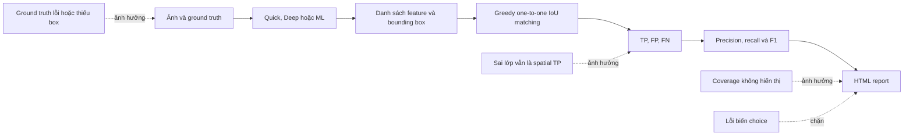

## Tình trạng hiện tại

| Hạng mục                      | Trạng thái       | Kết luận ngắn                                                      |
|-------------------------------|------------------|--------------------------------------------------------------------|
| Luồng benchmark single-image  | Đạt một phần     | Chạy được nhưng report ghi sai số ảnh và metric còn giới hạn       |
| Luồng benchmark batch         | Chưa đạt         | Có lỗi biến chưa khai báo tại bước tạo report                      |
| Công thức IoU                 | Đạt              | Đúng cho box dạng `x, y, width, height`                            |
| Công thức precision/recall/F1 | Đạt có điều kiện | Đúng từ TP/FP/FN hiện tại nhưng TP có thể bị xác định sai          |
| Detection theo lớp            | Chưa đạt         | Sai lớp vẫn được tính là TP localization                           |
| Coverage của metric           | Chưa đạt         | Report không cho biết metric thực sự dùng bao nhiêu ảnh            |
| Tính toàn vẹn ground truth    | Chưa đạt         | File lỗi có thể bị hiểu như annotation rỗng hợp lệ                 |
| Độc lập train/test            | Chưa kiểm soát   | GUI cho phép chọn bất kỳ thư mục và không lưu dataset version      |
| Benchmark synthetic           | Đạt một phần     | Tái lập được bằng seed nhưng chưa đại diện đầy đủ cho ảnh thật     |
| Benchmark thời gian           | Chưa đạt         | Một lần chạy, không warm-up và không kiểm soát thiết bị thực tế    |
| Unit test                     | Đạt một phần     | 14 test đạt nhưng chưa có integration test cho report và GUI       |
| ML runtime                    | Chưa xác minh    | Môi trường kiểm tra không có PyTorch và Ultralytics tương thích    |

### Phán quyết tổng thể

**Trạng thái: NOT READY FOR MODEL DECISION**

Benchmark có thể dùng để phát hiện lỗi phát triển hoặc quan sát xu hướng nội bộ.
Benchmark chưa thể trả lời đáng tin cậy các câu hỏi sau:

* Model có thực sự phát hiện tốt hơn Quick và Deep hay không
* Model nào có chất lượng tốt nhất trên ảnh kính hiển vi thật
* Precision, recall hoặc F1 hiện tại có đại diện cho toàn bộ dataset hay không
* Model có phân loại đúng loại vi nhựa hay chỉ định vị đúng particle
* Model có nhanh hơn phương pháp truyền thống trong điều kiện công bằng hay không

## Quy trình benchmark hiện tại



Sơ đồ cho thấy công thức cuối có thể đúng nhưng kết quả vẫn sai. Nếu ground truth,
phép matching hoặc tập ảnh đầu vào không đúng, precision và recall được tính đúng
trên các giá trị TP, FP, FN sai.

## Metric nào đang đúng và đúng với ý nghĩa nào

### IoU

Công thức trong `src/analysis/detection_metrics.py:22-33` đúng cho bounding box dạng
`(x, y, width, height)`:

```text
IoU = diện tích giao / diện tích hợp
```

Điều kiện để kết quả đúng:

* Prediction và ground truth cùng hệ tọa độ pixel
* Cả hai dùng định dạng `xywh`, không trộn với `xyxy`
* Width và height dương
* Box không bị thay đổi do resize mà thiếu phép biến đổi ngược

### TP, FP và FN

Code hiện tại định nghĩa một spatial match là TP khi IoU lớn hơn hoặc bằng ngưỡng.
Mặc định ngưỡng là 0.5. Mỗi prediction và mỗi ground truth chỉ được sử dụng một lần.

Định nghĩa này đúng cho **class-agnostic localization**. Nó chỉ trả lời câu hỏi:
"Model có đặt một box lên đúng particle hay không?" Nó chưa trả lời câu hỏi:
"Model có đặt đúng box và dự đoán đúng loại particle hay không?"

### Precision, recall và F1

Các công thức hiện tại đúng:

```text
precision = TP / (TP + FP)
recall    = TP / (TP + FN)
F1        = 2 * precision * recall / (precision + recall)
```

Batch metric được cộng dồn TP, FP và FN rồi mới tính tỷ lệ. Đây là micro-average,
phù hợp khi muốn mỗi particle có trọng số như nhau. Report hiện chưa ghi rõ đây là
micro-average và chưa hiển thị chính xác tập ảnh đã tham gia phép tính.

### Class accuracy

`class_accuracy` hiện được tính như sau:

```text
class_accuracy = số spatial match đúng lớp / tổng số spatial match
```

Metric này chỉ mô tả khả năng phân lớp **sau khi box đã match**. Nó không tính các
ground truth bị bỏ sót và prediction dư. Vì vậy không được trình bày như accuracy
tổng thể của model.

### Các metric chưa có

Benchmark hiện chưa tính các metric phổ biến để so sánh object detector:

* Class-aware precision, recall và F1
* Precision-recall curve theo confidence threshold
* AP50
* AP50-95
* AP và recall theo lớp
* Metric theo kích thước particle
* Confidence calibration
* Khoảng tin cậy hoặc độ biến thiên giữa các lần chạy

## Tổng hợp vấn đề và hướng sai lệch

| ID   | Mức độ | Vấn đề                               | Hướng sai lệch chính                      |
|------|--------|--------------------------------------|-------------------------------------------|
| B-01 | P0     | Biến `choice` chưa được khai báo     | Batch không tạo được report               |
| B-02 | P0     | GUI báo hoàn tất sau lỗi             | Lần chạy lỗi bị hiểu là thành công        |
| B-03 | P1     | Ground truth lỗi bị coi là hợp lệ    | FP tăng sai, precision giảm sai           |
| B-04 | P1     | Coverage không được công bố          | Metric tập con bị hiểu là toàn dataset    |
| B-05 | P1     | Declared count lệch parsed records   | Recall và tổng GT dùng mẫu số khác nhau   |
| B-06 | P1     | Timing protocol chưa công bằng       | Xếp hạng tốc độ không đáng tin            |
| B-07 | P1     | Trộn nhãn YOLO và nhãn heuristic     | Hai kết quả ML không đo cùng thành phần   |
| B-08 | P1     | Synthetic label khác footprint ảnh   | IoU phụ thuộc định nghĩa box              |
| B-09 | P2     | Single report mặc định có 0 ảnh      | Report mô tả sai phạm vi                  |
| B-10 | P1     | Greedy matching có thể tính thiếu TP | Precision, recall và F1 giảm sai          |
| B-11 | P1     | Chỉ có một operating point           | Không đủ để so sánh model tổng quát       |
| B-12 | P1     | Thiếu integration test               | Lỗi liên kết module lọt qua kiểm thử      |
| B-13 | P1     | Sai lớp vẫn được tính spatial TP     | Detection metric có thể cao giả           |
| B-14 | P1     | Chưa kiểm soát train/test leakage    | Kết quả có thể cao hơn khả năng tổng quát |

## B-01 Batch không tạo được report do biến chưa khai báo

### Tình trạng hiện tại

Hai luồng batch dùng `choice.startswith('Generate')` khi tạo trường
`synthetic_generation`. Trong cùng hàm, giá trị từ hộp thoại được lưu vào biến
`item`. Không có biến cục bộ hoặc biến toàn cục tên `choice`.

### Evidence

* `src/gui/main_window.py:2907`
* `src/gui/main_window.py:5336`
* Tìm kiếm toàn file chỉ thấy `choice` tại hai biểu thức trên
* Python chỉ phát hiện lỗi này khi nhánh tạo report được thực thi, nên `compileall`
  vẫn có thể đạt

### Ảnh hưởng

* Toàn bộ ảnh có thể đã được xử lý trước khi lỗi xuất hiện
* File HTML mới không được tạo
* Metadata, model hash và cấu hình benchmark không được lưu thành artifact cuối
* Người dùng có thể mở nhầm report cũ và xem đó là kết quả mới
* Không thể dùng batch report để so sánh các lần chạy

### Cách sửa chi tiết

1. Không dựa vào nội dung chuỗi hiển thị của GUI ở phần tạo report.
2. Ngay sau khi người dùng chọn nguồn dữ liệu, tạo biến rõ nghĩa:

   ```python
   source_mode = "synthetic" if "Generate" in item else "folder"
   synthetic_params = None
   ```

3. Khi tạo synthetic data, gán snapshot cấu hình độc lập với biến vòng lặp:

   ```python
   synthetic_params = vars(params).copy()
   synthetic_params["seed_policy"] = "benchmark_base_seed_plus_image_index"
   ```

4. Khi dựng payload, dùng giá trị đã chuẩn hóa:

   ```python
   "source_mode": source_mode,
   "synthetic_generation": synthetic_params,
   ```

5. Áp dụng cùng một helper cho benchmark thường và ML để tránh sửa một nơi nhưng
   bỏ sót nơi còn lại.
6. Thêm test chạy cả `source_mode = synthetic` và `source_mode = folder` đến bước
   tạo HTML.

### Tiêu chí xác nhận

* Hai loại batch đều tạo được file HTML mới
* Payload folder có `synthetic_generation = null`
* Payload synthetic lưu đúng cấu hình và seed policy
* Không còn tham chiếu đến biến `choice`

## B-02 Trạng thái hoàn tất không phản ánh lỗi report

### Tình trạng hiện tại

Ngoại lệ khi tạo HTML được bắt để hiển thị lỗi. Sau khối `except`, GUI vẫn đặt
progress về hoàn tất và hiển thị thông báo benchmark complete.

### Evidence

* `src/gui/main_window.py:2932-2938`
* `src/gui/main_window.py:5361-5369`
* Luồng single-image có hành vi tương tự tại `src/gui/main_window.py:2227-2235`

### Ảnh hưởng

* Trạng thái GUI không thể dùng làm bằng chứng benchmark thành công
* Người vận hành khó phân biệt lỗi phân tích và lỗi report
* Script hoặc quy trình kiểm tra thủ công có thể ghi nhận false success
* Một lỗi P0 bị che thành cảnh báo giao diện

### Cách sửa chi tiết

1. Tạo trạng thái run rõ ràng: `analysis_completed`, `report_completed` và
   `report_path`.
2. Chỉ hiển thị `Benchmark complete` khi cả phân tích và report đều thành công.
3. Khi report lỗi, hiển thị `Benchmark analysis completed, report failed`.
4. Không tự mở browser nếu file không tồn tại hoặc có kích thước bằng 0.
5. Trả về một kết quả có cấu trúc từ workflow thay vì chỉ cập nhật widget:

   ```python
   BenchmarkRunStatus(
       analysis_ok=True,
       report_ok=False,
       report_path=None,
       error_message=str(error),
   )
   ```

6. Ghi exception bằng logger và giữ stack trace trong log kỹ thuật.

### Tiêu chí xác nhận

* Lỗi report tạo trạng thái thất bại rõ ràng
* Không xuất hiện chữ complete khi report thất bại
* File tồn tại và đọc được trước khi GUI báo thành công

## B-03 Ground truth lỗi có thể bị coi là annotation rỗng

### Tình trạng hiện tại

Khi nạp thư mục ảnh, `has_ground_truth` chỉ dựa vào việc đường dẫn annotation có
tồn tại. Nếu parser thất bại, `ground_truth_data` có thể rỗng nhưng ảnh vẫn được
đánh dấu là có annotation.

### Evidence

* `src/gui/main_window.py:2514-2524`
* `src/gui/main_window.py:5056-5065`
* `src/data_generation/ground_truth_io.py:14-82` trả về count và particle nhưng
  chưa trả về trạng thái validation
* `evaluate_image_detections()` coi danh sách ground truth rỗng có `annotated=True`
  là một ảnh âm hợp lệ

### Ảnh hưởng

Nếu file thực tế có particle nhưng parser tạo danh sách rỗng, mọi prediction trên
ảnh đó bị tính là FP. Precision giảm không phải vì model sai mà vì annotation lỗi.

Ví dụ:

```text
Ảnh thật có 10 particle
Parser lỗi và trả ground_truth = []
Model dự đoán đúng 9 particle
Benchmark hiện tại có thể ghi TP=0, FP=9
```

### Cách sửa chi tiết

1. Thay cặp `ground_truth_count` và `has_ground_truth` bằng một kết quả parse có
   cấu trúc:

   ```python
   @dataclass
   class GroundTruthLoadResult:
       status: str
       declared_count: int | None
       particles: list[dict]
       errors: list[str]
   ```

2. Chuẩn hóa bốn trạng thái:

   * `missing`: không có file
   * `valid_empty`: file hợp lệ, declared count bằng 0 và không có record
   * `valid_annotated`: file hợp lệ, record đầy đủ
   * `invalid`: file tồn tại nhưng parse hoặc validation thất bại

3. Chỉ đặt `annotated=True` cho `valid_empty` và `valid_annotated`.
4. Ảnh `invalid` phải bị loại khỏi metric và xuất hiện trong `skipped_reasons`.
5. Report phải liệt kê tên file lỗi và lý do để người dùng sửa dataset.
6. Không dùng parser thủ công rồi gọi lại canonical parser. Chỉ giữ một parser làm
   source of truth.

### Tiêu chí xác nhận

* Annotation rỗng hợp lệ vẫn tính prediction là FP
* Annotation lỗi không được tính như ảnh âm
* Report tách riêng missing và invalid
* Có test cho file rỗng, file hỏng, thiếu bbox và count không khớp

## B-04 Coverage của metric không được công bố

### Tình trạng hiện tại

Batch evaluator trả về số ảnh được đánh giá và bị bỏ qua. Report HTML chỉ nói ảnh
thiếu spatial annotation sẽ bị skip, nhưng không hiển thị số lượng thực tế.

### Evidence

* `src/analysis/detection_metrics.py:207-214` tạo `total_images`,
  `evaluated_images`, `skipped_images` và `skipped_reasons`
* `src/analysis/report_generator.py:847-848` chỉ hiển thị ghi chú chung
* `src/analysis/report_generator.py:942` ghi `Averaged Across {num_images} Images`
* Không có chỗ hiển thị `evaluated_images` trong report generator

### Ảnh hưởng

Ví dụ batch có 500 ảnh nhưng chỉ 20 ảnh có box hợp lệ:

```text
Report dễ bị hiểu: F1 = 0.90 trên 500 ảnh
Ý nghĩa thực tế:   F1 = 0.90 trên 20 ảnh, 480 ảnh không tham gia metric
```

Metric không sai về phép chia, nhưng kết luận về toàn dataset là sai.

### Cách sửa chi tiết

1. Thêm một bảng `Evaluation Coverage` ở đầu report.
2. Hiển thị riêng cho mỗi phương pháp:

   * Total input images
   * Annotated images
   * Evaluated images
   * Skipped images
   * Skipped reasons
   * Evaluated predictions
   * Evaluated ground truth objects

3. Đổi tiêu đề metric thành `Micro-averaged over evaluated images`.
4. Khi coverage nhỏ hơn 100%, thêm cảnh báo nổi bật.
5. Đặt quality gate, ví dụ không cho trạng thái report hợp lệ nếu coverage thấp hơn
   ngưỡng cấu hình mà không có xác nhận của người dùng.
6. Khi so sánh average detections với average ground truth, dùng cùng tập
   `evaluated_images`. Có thể hiển thị thêm operational average trên toàn batch,
   nhưng phải đặt tên khác.

### Tiêu chí xác nhận

* Người đọc biết chính xác F1 dùng bao nhiêu ảnh và bao nhiêu particle
* Prediction average và GT average dùng cùng denominator khi đặt cạnh nhau
* Coverage dưới ngưỡng sinh warning rõ ràng

## B-05 Declared count và parsed records chưa được đối chiếu

### Tình trạng hiện tại

Parser đọc số particle khai báo ở dòng đầu và danh sách record riêng biệt. Không có
validation bắt buộc hai giá trị bằng nhau. Tổng GT trong report có thể dùng declared
count, còn recall dùng số record đã parse và có bounding box.

### Evidence

* `src/data_generation/ground_truth_io.py:24-29` đọc declared count
* `src/data_generation/ground_truth_io.py:31-82` tạo danh sách particle
* Hàm trả cả hai giá trị nhưng không kiểm tra `declared_count == len(particles)`
* `src/gui/main_window.py:2804` và `src/gui/main_window.py:5214` dùng declared count
  cho thống kê ground truth
* `src/analysis/detection_metrics.py:77-86` dùng record có hình học cho spatial metric

### Ảnh hưởng

Một report có thể hiển thị tổng GT là 100 nhưng recall thực tế dùng 92 record. Người
đọc không thể tái tính metric từ các con số trong report.

### Cách sửa chi tiết

1. Validation phải thất bại khi declared count khác số record.
2. Mỗi record cần có shape và bounding box hợp lệ cho spatial evaluation.
3. Kiểm tra box có bốn số hữu hạn, width và height dương, nằm trong kích thước ảnh.
4. Lưu cả `declared_count` và `validated_count` để phục vụ audit.
5. Chỉ dùng `validated_count` cho metric và biểu đồ.
6. Không sửa count âm thầm. File lỗi phải được liệt kê để người quản lý dataset sửa.

### Tiêu chí xác nhận

* Tổng GT trong report bằng `evaluated_ground_truth`
* Có thể tái tính recall từ TP và FN trong report
* Mọi mismatch đều tạo lỗi validation có tên file

## B-06 Timing protocol chưa công bằng

### Tình trạng hiện tại

Mỗi ảnh được đo một lần, không warm-up. Quick luôn chạy trước Deep, và ML chạy sau
cùng. ML timing bao gồm YOLO inference cùng segmentation, shape analysis và color
analysis cho từng ROI.

### Evidence

* `src/analysis/benchmark_metadata.py:51` ghi rõ
  `single measured pass per image; no warm-up`
* `src/analysis/ml_benchmark_analyzer.py:50-156` đo toàn bộ pipeline ML bằng
  `time.time()`
* `src/gui/main_window.py:5096-5159` chạy cố định Quick, Deep rồi ML
* Metadata suy ra device từ việc CUDA có sẵn, không xác nhận model đang dùng device đó

### Ảnh hưởng

* Lần ML đầu chịu chi phí khởi tạo model, kernel và GPU context
* Cache và nhiệt độ thiết bị khác nhau giữa các phương pháp
* Một giá trị trung bình không cho biết độ ổn định
* Không thể phân biệt raw inference time và end-to-end pipeline time
* Model có thể bị đánh giá chậm sai hoặc nhanh sai tùy trạng thái máy

### Cách sửa chi tiết

1. Xác định hai metric thời gian riêng:

   * `inference_time_ms`: chỉ thời gian model dự đoán box
   * `end_to_end_time_ms`: toàn bộ detection và hậu xử lý

2. Dùng `time.perf_counter_ns()` cho CPU timing.
3. Với CUDA, gọi `torch.cuda.synchronize()` ngay trước và sau vùng đo.
4. Chạy tối thiểu ba warm-up pass không ghi kết quả.
5. Chạy nhiều repeat trên cùng benchmark set. Số repeat phải là cấu hình.
6. Xoay hoặc randomize thứ tự phương pháp giữa các repeat.
7. Báo cáo median, p90, mean và standard deviation, không chỉ mean.
8. Ghi model device thực tế sau khi model đã chạy.
9. Lưu `imgsz`, confidence, NMS IoU, `max_det`, precision mode và batch size.
10. Khóa các ứng dụng nền hoặc ghi rõ điều kiện máy nếu kết quả dùng để trình bày.

### Tiêu chí xác nhận

* Có raw samples cho từng repeat
* Có warm-up và không đưa warm-up vào thống kê
* CPU/GPU device trong report đúng với device thực thi
* Có cả inference-only và end-to-end latency
* Chênh lệch tốc độ được báo cùng độ biến thiên

## B-07 Nhãn YOLO và nhãn hậu xử lý đang bị trộn

### Tình trạng hiện tại

Spatial class evaluation của ML dùng `ml_class`, tức nhãn từ YOLO. Shape
distribution của cùng mục ML lại dùng `shape`, tức nhãn từ heuristic hình học chạy
sau segmentation ROI.

### Evidence

* `src/gui/main_window.py:5174-5176` truyền `prediction_class_key='ml_class'`
* `src/gui/main_window.py:5258-5266` dùng `feature['shape']` cho ML distribution
* `src/analysis/ml_benchmark_analyzer.py:128-145` lưu cả `shape` và `ml_class`

### Ảnh hưởng

Hai biểu đồ cùng mang tên ML nhưng đo hai hệ thống khác nhau. Một model có thể dự
đoán sai lớp YOLO nhưng heuristic phân loại đúng, hoặc ngược lại. Report không cho
biết tầng nào tạo ra kết quả.

### Cách sửa chi tiết

1. Đặt tên rõ hai đầu ra:

   * `yolo_class`
   * `postprocess_shape_class`

2. Tạo hai bộ metric riêng:

   * `YOLO detection and classification`
   * `YOLO localization plus shape heuristic`

3. Không dùng chung một nhãn `ML Benchmark` cho hai pipeline.
4. Confusion matrix phải ghi rõ nguồn predicted class.
5. Nếu mục tiêu là đánh giá model YOLO, biểu đồ lớp chính phải dùng `yolo_class`.
6. Nếu mục tiêu là đánh giá sản phẩm end-to-end, báo cáo cả hai tầng và lỗi chuyển tiếp.

### Tiêu chí xác nhận

* Mỗi metric có tên pipeline và nguồn nhãn rõ ràng
* Không còn biểu đồ ML dùng nhãn khác với confusion matrix mà không giải thích

## B-08 Ground truth synthetic phụ thuộc định nghĩa footprint

### Tình trạng hiện tại

Synthetic generator tính area và bounding box từ mask lý tưởng trước blur, glow,
noise và optical blur. Ảnh cuối cùng có thể có vùng sáng rộng hơn box annotation.

### Evidence

* `src/data_generation/synthetic_generator.py:170-185` tính box trước `_apply_effects()`
* `src/data_generation/synthetic_generator.py:221-225` thêm noise và optical blur
* `src/data_generation/synthetic_generator.py:378-401` mở rộng footprint bằng blur và glow
* Mặc định `max_overlap_ratio = 0.0` trong `config/settings.py:30`
* Noise thực tế dùng khoảng hard-code tại
  `src/data_generation/synthetic_generator.py:403-419`

### Ảnh hưởng

Đây là vấn đề về định nghĩa ground truth:

* Nếu mục tiêu là box của lõi particle, annotation hiện tại có thể hợp lệ
* Nếu mục tiêu là toàn bộ footprint huỳnh quang nhìn thấy, annotation hiện tại nhỏ hơn đối tượng quan sát

Nếu không công bố định nghĩa, model bao vùng sáng có thể bị phạt IoU dù kết quả hữu
ích về mặt thị giác. Dữ liệu không overlap cũng làm bài toán dễ hơn ảnh thật.

### Cách sửa chi tiết

1. Chốt annotation policy trước khi sửa code:

   * `core_particle_bbox` cho hình học vật thể gốc
   * `visible_fluorescence_bbox` cho vùng tín hiệu nhìn thấy

2. Lưu instance mask gốc để ground truth có thể audit.
3. Nếu cần visible bbox, threshold mask sau hiệu ứng theo một ngưỡng được cấu hình và
   ghi vào metadata.
4. Không ghi đè bbox cũ. Lưu hai trường nếu cả hai có giá trị khoa học.
5. Dùng `background_noise_min/max` từ config thay cho khoảng hard-code.
6. Tạo nhiều difficulty tier: không overlap, chạm nhau, overlap nhẹ và noise cao.
7. Báo cáo synthetic và ảnh thật thành hai nhóm riêng.

### Tiêu chí xác nhận

* Report ghi rõ định nghĩa box
* Annotation có thể đối chiếu với instance mask
* Benchmark có nhiều mức độ khó và không chỉ dùng ảnh không overlap

## B-09 Single-image report ghi sai số ảnh

### Tình trạng hiện tại

Payload single-image không đặt `num_images`. Report generator mặc định trường này
bằng 0.

### Evidence

* Payload bắt đầu tại `src/gui/main_window.py:2095` nhưng không có `num_images`
* `src/analysis/report_generator.py:767` dùng `results.get('num_images', 0)`

### Ảnh hưởng

Report có thể ghi `0 Images Analyzed` và `Averaged Across 0 Images`. Detection không
đổi nhưng artifact mất độ tin cậy khi được trình bày độc lập.

### Cách sửa chi tiết

1. Thêm `num_images = 1` vào payload single-image.
2. Với một ảnh, đổi nhãn `Avg Detected` thành `Detected`.
3. Không hiển thị phần batch summary cho single-image.
4. Thêm snapshot test cho nội dung HTML.

### Tiêu chí xác nhận

* Single report luôn ghi một ảnh
* Không xuất hiện cụm `Averaged Across 0 Images`

## B-10 Greedy matching có thể tính thiếu TP

### Tình trạng hiện tại

Tất cả cặp prediction và ground truth đạt IoU threshold được sắp theo IoU giảm dần.
Code chọn lần lượt cặp cao nhất chưa sử dụng. Thuật toán không bảo đảm số match lớn
nhất.

### Evidence

* `src/analysis/detection_metrics.py:91-112`
* Một counterexample đã được chạy với IoU threshold 0.5:

  ```text
  Có hai prediction và hai ground truth
  Tồn tại phương án ghép hợp lệ với TP=2
  Greedy hiện tại trả TP=1, FP=1, FN=1
  Precision=0.5, Recall=0.5, F1=0.5
  Phương án tối ưu có Precision=1.0, Recall=1.0, F1=1.0
  ```

### Ảnh hưởng

Model có thể bị đánh giá thấp hơn thực tế trên ảnh có particle gần nhau hoặc overlap.
Mức sai lệch có thể thay đổi theo mật độ particle, nên hai dataset có cùng model
nhưng khác mật độ sẽ không còn so sánh công bằng.

### Cách sửa chi tiết

1. Xác định policy matching theo loại phương pháp:

   * Detector có confidence: sắp prediction theo confidence rồi match ground truth
     có IoU cao nhất còn trống, phù hợp cách đánh giá detector phổ biến
   * Phương pháp không có confidence: dùng maximum-cardinality matching và ưu tiên
     tổng IoU cao trong số các phương án có cùng số match

2. Có thể dùng Hungarian assignment với cost được thiết kế để ưu tiên số match hợp lệ
   trước, sau đó mới tối đa tổng IoU.
3. Không dùng tối đa tổng IoU đơn thuần nếu nó có thể hy sinh số match.
4. Thêm counterexample trên thành regression test.
5. Thêm test cho tie, duplicate prediction, overlap và nhiều prediction quanh một GT.

### Tiêu chí xác nhận

* Counterexample trả TP=2
* Kết quả không phụ thuộc thứ tự input khi confidence bằng nhau hoặc không tồn tại
* Policy matching được ghi vào report metadata

## B-11 Một operating point chưa đủ để so sánh model

### Tình trạng hiện tại

Benchmark dùng một confidence threshold 0.25 và một evaluation IoU threshold 0.5.
Precision, recall và F1 chỉ đại diện cho một điểm vận hành.

### Evidence

* `config/settings.py:37-39`
* `src/analysis/ml_benchmark_analyzer.py:61` truyền một confidence threshold vào YOLO
* Không có confidence sweep hoặc AP calculation trong `src/analysis/`

### Ảnh hưởng

Hai model có thể đổi thứ hạng khi confidence threshold thay đổi. Chọn threshold sau
khi xem test result còn gây tuning leakage. Một model có F1 cao tại 0.25 chưa chắc
có PR curve hoặc AP tốt hơn.

### Cách sửa chi tiết

1. Chọn operating threshold trên validation set, không chọn trên test set.
2. Khóa threshold trước khi chạy final benchmark.
3. Với ML detector, lưu prediction ở confidence thấp đủ để dựng PR curve.
4. Tính AP50, AP50-95 và AP theo lớp bằng evaluator đã kiểm chứng.
5. Giữ F1 tại operating point để phản ánh cấu hình triển khai.
6. Quick và Deep không có confidence score tương đương. So sánh chúng với ML tại
   operating point, không giả lập mAP cho heuristic nếu không có ranking score hợp lệ.

### Tiêu chí xác nhận

* Threshold selection và final test là hai bước tách biệt
* Report có PR curve và AP cho ML
* Report ghi rõ metric nào chỉ dùng cho ML và metric nào dùng để so sánh cả ba phương pháp

## B-12 Thiếu integration test cho benchmark và report

### Tình trạng hiện tại

Unit test hiện kiểm tra IoU, duplicate detection, annotation rỗng, parser và synthetic
ground truth. Không có test chạy xuyên suốt từ input batch đến payload và HTML.

### Evidence

* 14 unit test trong `tests/unit/` đã đạt
* Không có test gọi hoàn chỉnh `_run_batch_benchmark()` hoặc report workflow
* Lỗi `choice` vẫn tồn tại dù compile và unit test đều đạt

### Ảnh hưởng

Các module riêng lẻ có thể đúng nhưng cách nối chúng vẫn sai. Đây là nguyên nhân lỗi
report không bị phát hiện trước khi chạy thật.

### Cách sửa chi tiết

1. Tách orchestration khỏi PyQt widget thành một service có thể test.
2. Mock analyzer để test nhanh, không cần model thật.
3. Thêm integration test cho:

   * Single-image report
   * Synthetic batch report
   * Folder batch report
   * Mixed valid và invalid annotations
   * Optional ML dependencies không khả dụng
   * Report write failure

4. Dùng temporary directory và kiểm tra file HTML tồn tại, có kích thước dương.
5. Parse nội dung report để kiểm tra `num_images`, coverage và metric labels.
6. Thêm test với ML model giả có box, confidence và class xác định trước.

### Tiêu chí xác nhận

* Lỗi biến chưa khai báo bị test phát hiện
* Core Quick và Deep vẫn chạy khi ML dependency không có
* Cả success path và failure path đều có test

## B-13 Sai lớp vẫn được tính là spatial TP

### Tình trạng hiện tại

Sau khi hai box match theo IoU, code tăng TP bất kể predicted class có bằng ground
truth class hay không. Sai lớp chỉ làm giảm `class_accuracy`.

### Evidence

* `src/analysis/detection_metrics.py:108-127` tạo match trước khi kiểm tra class
* `true_positives = len(matches)` tại `src/analysis/detection_metrics.py:127`
* Unit test `test_wrong_class_is_recorded_on_spatial_match` xác nhận sai lớp vẫn là TP

### Ảnh hưởng

Ví dụ:

```text
Ground truth: Fragment
Prediction:   Fiber, box đúng hoàn toàn

Localization metric: TP=1, precision=1.0, recall=1.0
Class result:        class_accuracy=0.0
```

Nếu báo cáo chỉ trình bày precision và recall mà không ghi class-agnostic, model có
thể trông tốt dù phân loại sai toàn bộ particle.

Confusion matrix hiện cũng chỉ chứa các spatial match. FP và FN không xuất hiện như
lớp background, nên ma trận không phản ánh toàn bộ lỗi detection.

### Cách sửa chi tiết

1. Giữ bộ metric hiện tại nhưng đổi tên rõ:

   * `localization_precision`
   * `localization_recall`
   * `localization_f1`

2. Tạo thêm class-aware metric. Một class-aware TP phải thỏa cả IoU và đúng lớp.
3. Prediction đúng vị trí nhưng sai lớp phải tạo:

   * Một FP cho lớp dự đoán
   * Một FN cho lớp ground truth

4. Tính precision, recall, F1 và AP theo từng lớp.
5. Mở rộng confusion matrix với background hoặc cung cấp bảng FP/FN riêng.
6. Report phải trình bày localization và classification thành hai phần độc lập.

### Tiêu chí xác nhận

* Ví dụ sai lớp có localization F1 bằng 1.0 nhưng class-aware F1 bằng 0.0
* Người đọc không thể nhầm hai metric
* Có per-class support để biết lớp ít mẫu

## B-14 Chưa kiểm soát độc lập train, validation và test

### Tình trạng hiện tại

GUI cho phép người dùng chọn bất kỳ thư mục ảnh để benchmark. Dataset exporter có
các thư mục train, validation và test, nhưng benchmark không kiểm tra split, dataset
version hoặc trùng lặp với dữ liệu model đã học.

### Evidence

* `src/gui/main_window.py:2407-2425` và `src/gui/main_window.py:4948-4967` nhận thư mục tự do
* Dataset exporter tạo train, validation và test tại
  `src/gui/main_window.py:4408-4485`
* Benchmark metadata không lưu manifest hoặc hash của dataset
* Synthetic benchmark dùng seed cố định nhưng không có registry chứng minh seed test
  khác seed dùng cho training

### Ảnh hưởng

Nếu ảnh train hoặc ảnh gần trùng train xuất hiện trong benchmark, metric có thể cao
hơn đáng kể so với khả năng tổng quát hóa. Đây là data leakage và có thể làm mất
giá trị toàn bộ kết luận dù công thức metric hoàn toàn đúng.

### Cách sửa chi tiết

1. Tạo dataset manifest chứa:

   * Dataset ID và version
   * Split của từng ảnh
   * Relative path và SHA-256 của ảnh
   * Annotation hash
   * Generator version và seed nếu là synthetic

2. Final benchmark chỉ nhận split `test` đã khóa.
3. Validation set dùng để chọn confidence threshold và cấu hình hậu xử lý.
4. Training set không được dùng để báo cáo final metric.
5. Kiểm tra hash trùng giữa train, validation và test trước khi chạy.
6. Với synthetic data, cấp dải seed hoặc namespace seed riêng cho từng split.
7. Lưu dataset manifest hash vào benchmark metadata.
8. Nếu người dùng chọn thư mục không có manifest, report phải ghi trạng thái
   `unverified_dataset` và không gắn nhãn final benchmark.

### Tiêu chí xác nhận

* Không có hash trùng giữa các split
* Report xác định được dataset version và test split
* Có thể tái tạo đúng danh sách file đã benchmark
* Threshold không được chọn bằng final test set

## Thứ tự sửa đề xuất

### Giai đoạn 1 Khôi phục benchmark chạy đúng

1. Sửa B-01 để batch tạo report được.
2. Sửa B-02 để trạng thái GUI phản ánh đúng thành công hoặc thất bại.
3. Sửa B-09 để single report ghi đúng một ảnh.
4. Thêm integration test tối thiểu trong B-12.

Kết quả sau giai đoạn 1: benchmark tạo artifact ổn định, nhưng metric chưa đủ tin cậy
để đánh giá model.

### Giai đoạn 2 Bảo đảm metric đúng

1. Sửa B-03 và B-05 để ground truth được xác thực.
2. Sửa B-04 để công bố coverage và thống nhất denominator.
3. Sửa B-10 để matching không tính thiếu TP.
4. Sửa B-13 để tách localization và class-aware metric.

Kết quả sau giai đoạn 2: precision, recall và F1 có định nghĩa rõ, có thể audit và
không bị sai do annotation hoặc matching.

### Giai đoạn 3 Chuẩn hóa đánh giá model

1. Sửa B-14 để khóa dataset version và test split.
2. Sửa B-11 để thêm PR curve và AP cho model ML.
3. Sửa B-07 để tách nhãn YOLO khỏi heuristic hậu xử lý.
4. Sửa B-06 để timing có warm-up và repeat.
5. Sửa B-08 để định nghĩa rõ ground truth synthetic và bổ sung ảnh thật.

Kết quả sau giai đoạn 3: benchmark có thể dùng để so sánh model và hỗ trợ quyết định
kỹ thuật, với điều kiện test set đủ đại diện.

## Kế hoạch kiểm thử sau khi sửa

### Unit test metric

* IoU bằng 0, bằng 1 và đúng tại threshold
* Duplicate prediction
* Empty valid annotation
* Missing và invalid annotation
* Sai lớp nhưng đúng box
* Greedy counterexample
* Box có NaN, infinity, width âm hoặc ngoài ảnh

### Integration test workflow

* Single-image tạo report có `num_images = 1`
* Synthetic batch tạo report và lưu seed policy
* Folder batch tạo report mà không cần synthetic params
* Report failure tạo trạng thái thất bại
* Coverage trong payload bằng coverage hiển thị trong HTML
* Quick và Deep chạy khi PyTorch hoặc Ultralytics không khả dụng

### Validation dataset

* Không trùng hash giữa train, validation và test
* Declared count bằng validated particle count
* Mọi box nằm trong kích thước ảnh
* Phân bố lớp và kích thước được công bố
* Có cả ảnh âm, ảnh mật độ thấp và ảnh mật độ cao

### Performance validation

* Warm-up không được tính vào timing
* Có nhiều repeat
* CUDA được synchronize khi sử dụng
* Có median, p90 và standard deviation
* Có inference-only và end-to-end latency

## Tiêu chí cho phép dùng benchmark để đánh giá model

Chỉ chuyển trạng thái sang `READY FOR MODEL DECISION` khi đạt tất cả điều kiện:

* Batch và single report đều tạo thành công
* Không có false success trên GUI
* Ground truth được xác thực và có dataset manifest
* Train, validation và test độc lập
* Report công bố evaluated và skipped images
* Matching policy đã được kiểm chứng bằng regression test
* Localization metric và class-aware metric được tách riêng
* Threshold được chọn trên validation set
* Final metric chỉ chạy trên test set đã khóa
* Timing có warm-up, repeat và thống kê biến thiên
* Synthetic và ảnh thật được báo cáo riêng
* ML configuration, model hash, code revision và environment được lưu
* Một người phụ trách kỹ thuật đã kiểm tra report và xác nhận định nghĩa metric

