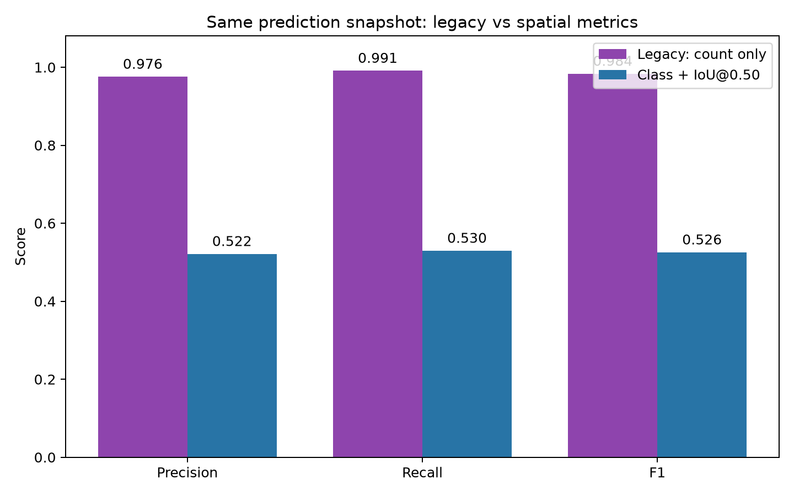
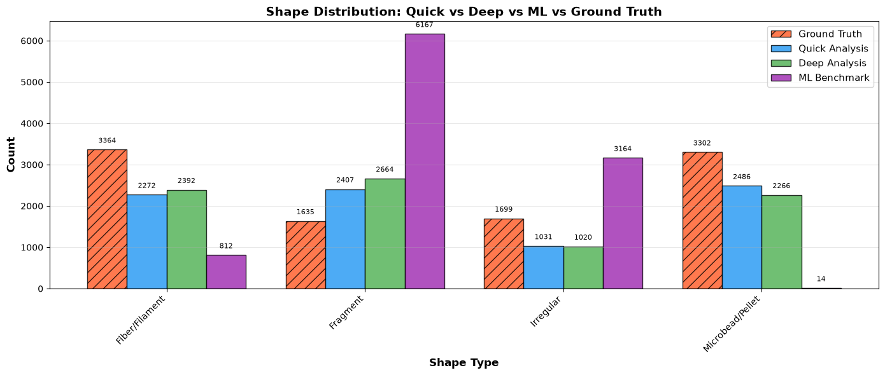
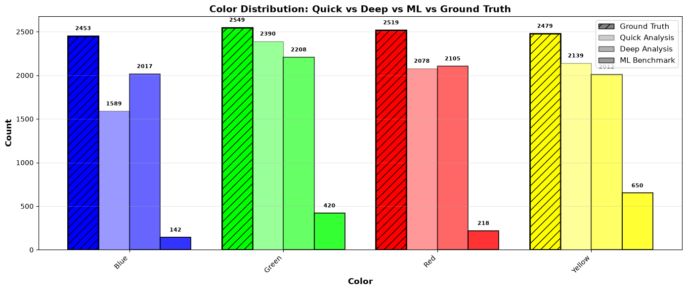
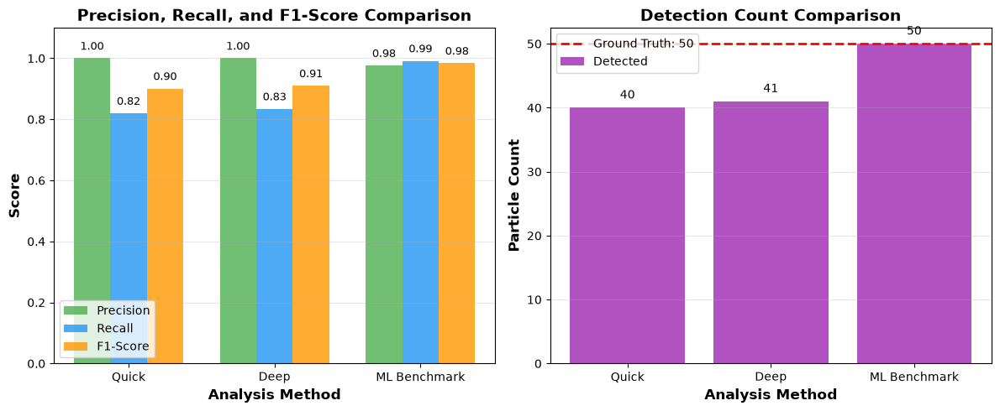
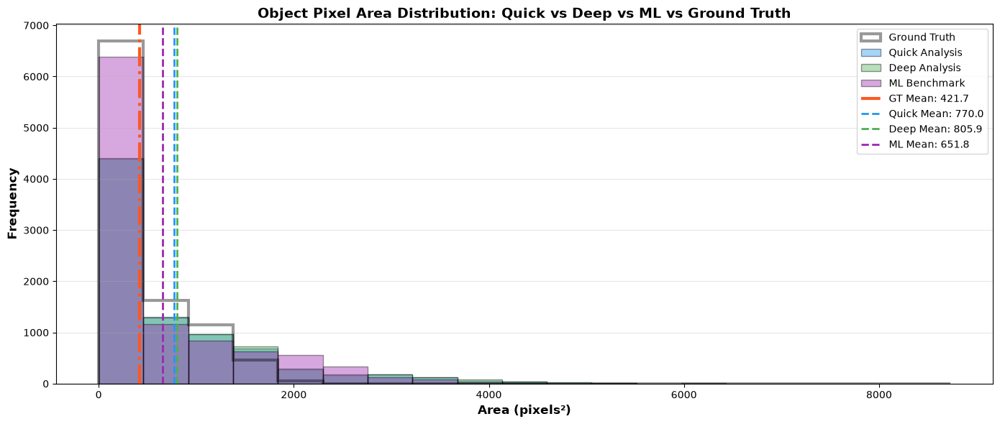

# Pre-Repair Benchmark Evaluation

## 1. Executive conclusion

The legacy baseline **does not support the conclusion that YOLO26m achieved F1 = 0.984**. That value measured only the similarity between the **number of predictions** and the **number of Ground Truth (GT) objects** in each image. It did not verify object identity, bounding-box location, or class.

On the same snapshot of 10,157 predictions accepted by the legacy ML pipeline:

| Evaluation method | TP | FP | FN | Precision | Recall | F1 |
|---|---:|---:|---:|---:|---:|---:|
| Legacy benchmark: count-only | 9,914 | 243 | 86 | 0.9761 | 0.9914 | **0.9837** |
| Same-class matching at IoU ≥ 0.50 | 5,298 | 4,859 | 4,702 | 0.5216 | 0.5298 | **0.5257** |
| Difference caused by the evaluator | −4,616 TP | +4,616 FP | +4,616 FN | −0.4545 | −0.4616 | **−0.4580** |

The legacy F1 was therefore inflated by **45.80 percentage points**. The count formula labeled 4,616 predictions as true positives even though they could not be matched to a GT object of the same class at IoU 0.50.



## 2. Scope and provenance

### User-generated baseline

| Property | Value |
|---|---|
| Report | `benchmark_results/ml_benchmark_200images_20260825_001406.html` |
| Report SHA-256 | `bccf6444759e4199221c264f418ddc134f00c4976109c0aec165ef651ec49d02` |
| Report timestamp | 2026-08-25 00:14:08 |
| Displayed ML result | Precision 0.976; Recall 0.991; F1 0.984 |
| Limitation | The HTML does not store raw predictions, input order, or provenance sidecar data |

### Independent evaluator audit

| Property | Value |
|---|---|
| Dataset | `benchmark_results/dataset/20260824` |
| Dataset manifest SHA-256 | `d5d55d44aa9a8cff6f39a292a7f99e186887a15b8c0c5ac300399b8e5f4d5a23` |
| Model | `src/ml/Yolo26m/best.pt` |
| Model SHA-256 | `c308593934437df75a9ea34ef0a6cca11337fcbe66159b2293d295be9807da5c` |
| Confidence | 0.25 |
| Spatial rule | One-to-one, same class, IoU ≥ 0.50 |
| Predictions after the legacy pipeline | 10,157 |
| GT objects | 10,000 |
| Audit JSON SHA-256 | `f90af3621a0e6aa5fab79d8511329a8092f9b2e6058e426a1a584b6701abb2d8` |

The audit reran inference because the baseline HTML did not contain predicted bounding boxes. These are not claimed to be the boxes from the exact `001406` inference. However, the audit used the same dataset, model, confidence threshold, and legacy ML processing path. The legacy formula on the audit snapshot reproduced the exact unrounded values **P = 0.9760756, R = 0.9914, and F1 = 0.9836781**, matching `0.976 / 0.991 / 0.984` in the HTML.

## 3. Dataset inventory

The dataset was complete enough to audit the legacy evaluator:

| Item | Count |
|---|---:|
| PNG images | 200 |
| GT files | 200 |
| Total GT objects | 10,000 |
| Positive bounding boxes inside image bounds | 10,000 |
| Objects per image | 50 |
| Microbead/Pellet | 3,302 |
| Fiber/Filament | 3,364 |
| Irregular, including Fragment + Irregular | 3,334 |

Three Fiber GT objects have 1×1 boxes after erosion: `synthetic_069 #1`, `synthetic_147 #4`, and `synthetic_199 #3`. Excluding them changes spatial F1 from `0.525673` to `0.525752`, only `+0.000079`. These three boxes **do not explain** the 45.80 percentage-point discrepancy.

## 4. Direct visual evidence

The following figure shows four images with exactly 50 predictions and 50 GT objects. The legacy formula assigns **F1 = 1.000** to every image solely because the counts are equal. Bounding-box matching produces F1 values of only **0.360 to 0.400**.

Color legend:

- Green: matched GT.
- Yellow: missed GT.
- Cyan: prediction matched by class and IoU.
- Red: unmatched prediction, counted as a false positive.


| Image | Predictions | GT | Count F1 | Bounding-box TP/FP/FN | Bounding-box F1 |
|---|---:|---:|---:|---:|---:|
| `synthetic_076` | 50 | 50 | **1.000** | 18 / 32 / 32 | **0.360** |
| `synthetic_002` | 50 | 50 | **1.000** | 20 / 30 / 30 | **0.400** |
| `synthetic_006` | 50 | 50 | **1.000** | 20 / 30 / 30 | **0.400** |
| `synthetic_138` | 50 | 50 | **1.000** | 20 / 30 / 30 | **0.400** |

Full-resolution evidence is stored as `overlay_synthetic_*.png` for detailed inspection during a presentation.

## 5. Incorrect or misleading benchmark behavior

### Issue 1 — Precision, recall, and F1 were not detection metrics

**Legacy behavior**

The source calculated each image as follows:

```python
tp = min(detected, gt)
fp = max(0, detected - gt)
fn = max(0, gt - detected)
```

This code was at `src/gui/main_window.py:5222-5224`.

**Evidence**

GT files contain `Bounding Box` records, but the legacy parser handled only `Position`, `Area`, and `Size` at `src/gui/main_window.py:5052-5059`. It did not parse `Bounding Box`, so the evaluator had no spatial data for object matching.

For `synthetic_076`, equal counts produced TP=50, FP=0, and FN=0. Real matching found only 18 TP, with 32 FP and 32 FN.

**Impact**

- The metric did not measure object detection.
- Wrong-location, wrong-size, or wrong-object predictions could be counted as TP.
- Duplicate predictions were hidden when aggregate counts happened to be close.
- F1=0.984 suggested near-perfect performance while spatial F1 was only 0.526.

**Detailed repair**

1. Parse GT boxes in pixel `xywh` and convert to `xyxy` only through a controlled helper.
2. Normalize the three classes and map `Fragment → Irregular`.
3. Sort predictions by confidence and enforce one-to-one same-class matching.
4. Count a TP only when class and IoU requirements are satisfied; unmatched predictions are FP and unmatched GT objects are FN.
5. Aggregate TP/FP/FN over the dataset before computing micro metrics, and also report each class.
6. Test perfect matches, wrong location, wrong class, duplicates, no predictions, and no GT.

### Issue 2 — The ML shape chart did not use YOLO classes

**Legacy behavior**

YOLO has three classes, but the baseline chart displayed four groups: `Fiber/Filament`, `Fragment`, `Irregular`, and `Microbead/Pellet`.



The YOLO class was stored in `feature['ml_class']`, while the report aggregated `feature['shape']`, a geometric heuristic produced by `ShapeAnalyzer` inside the ROI. `SHAPE_GROUP_MAPPING` also kept `Fragment` and `Irregular` separate, contrary to the model's three-class ontology.

**Numerical evidence**

| Source | Fiber/Filament | Irregular | Microbead/Pellet | Note |
|---|---:|---:|---:|---|
| Canonical GT | 3,364 | 3,334 | 3,302 | Correct three classes |
| Raw YOLO class in the audit | 3,465 | 3,279 | 3,413 | Correct three classes |
| Purple report bars | 812 | 6,167 + 3,164 | 14 | Four-group heuristic, not YOLO class |

The raw YOLO totals appear close to GT, but aggregate similarity does not prove object correctness. Fiber/Filament had 3,465 predictions versus 3,364 GT objects, while bounding-box matching found only 160 TP in the independent audit.

**Impact and repair**

- Readers could mistake a post-processing morphology classifier for YOLO classification performance.
- A four-group ontology could not be compared directly with the three-class model.
- The YOLO class chart must use `ml_class`; heuristic morphology must be shown separately.
- Aggregate distributions must not replace a confusion matrix or per-class detection metrics.

### Issue 3 — The color chart was not a model color-prediction metric

YOLO26m has no color classes. `ColorAnalyzer.extract_color_from_region()` inferred color inside each detected bounding box, and the report retained only Red, Green, Blue, and Yellow.



The ML bars contained only 142 Blue + 420 Green + 218 Red + 650 Yellow = **1,430 objects**, or **14.08%** of 10,157 predictions. The other 8,727 results disappeared because colors outside the whitelist or `Unknown` were excluded.

This chart could be misread as poor model color prediction, even though it represented ROI post-processing and omitted most outputs. It should be labeled `ROI color post-processing distribution`, display `Unknown/Other` and coverage, and evaluate color only after object-level prediction-to-GT matching.

### Issue 4 — Average counts were truncated

The report used `int(np.mean(ml_detections))`. The audit produced 10,157 / 200 = **50.785 predictions per image**, but the report displayed **50**. Because GT was also 50 per image, the summary appeared to show an exact match.



The displayed average was low by `0.785 object/image`, hiding 157 excess detections. The report should retain one or two decimal places and include total detections, median, standard deviation, and range. Average count remains descriptive and does not replace a detection metric.

### Issue 5 — Area distributions compared unmatched object populations

The chart compared the area distribution of all GT objects with that of all predictions. ML area came from a re-segmented ROI mask or fell back to bounding-box area, which was not necessarily the same definition as GT area.



The report showed GT mean `421.7 px²` and ML mean `651.8 px²`, but did not compare the same objects or state the number of valid pairs. With 4,859 unmatched predictions and 4,702 missed GT objects, the histograms represented different populations.

The difference between means must not be interpreted as per-object model area error. MAE, median absolute error, bias, and relative or Bland–Altman error should be calculated only on matched pairs using a consistent area definition.

### Issue 6 — Provenance and replay snapshots were missing

The HTML did not store a dataset path or hash, ordered image list, model hash, confidence, raw boxes, or a JSON sidecar. Folder inputs were collected without a guaranteed sort order.

This prevented replay of the exact `001406` prediction boxes and made it difficult to prove that before/after runs used identical inputs, model, and configuration.

Each run should store a versioned snapshot containing the run ID, source revision, dataset manifest and hash, ordered image IDs, image and GT hashes, model path and hash, classes, confidence, IoU, image size, device, raw predictions, per-image metrics, and report hash.

## 6. Independent-audit spatial results by class

| Class | GT | TP | FP | FN | Precision | Recall | F1 |
|---|---:|---:|---:|---:|---:|---:|---:|
| Fiber/Filament | 3,364 | 160 | 3,305 | 3,204 | 0.0462 | 0.0476 | **0.0469** |
| Irregular | 3,334 | 2,981 | 298 | 353 | 0.9091 | 0.8941 | **0.9016** |
| Microbead/Pellet | 3,302 | 2,157 | 1,256 | 1,145 | 0.6320 | 0.6532 | **0.6424** |

Localization-only matching found 5,325 pairs, while class-aware matching found 5,298. The difference was only 27 pairs. The dominant problem in this snapshot was therefore **localization/bounding-box quality**, especially for Fiber/Filament, rather than class confusion among correctly localized objects.

## 7. Which baseline values are usable

| Baseline component | Assessment | Permitted use |
|---|---|---|
| 200 images and 10,000 GT objects | Valid | Dataset description |
| Total and average detections | Descriptive, but the average was truncated | Use only after display repair; do not call it accuracy |
| Quick, Deep, and ML precision/recall/F1 | **Invalid as detection metrics** | Recalculate through object matching |
| ML shape distribution | **Wrong source for YOLO class evaluation** | Use `ml_class`; display the heuristic separately |
| ML color distribution | Misleading and very low coverage | Treat as ROI post-processing and include Unknown/coverage |
| Area distribution | Unmatched populations with different definitions | Evaluate only matched pairs with the same area definition |
| Processing time | Insufficiently controlled | Do not use for before/after performance conclusions |

## 8. Recommended repair order and rerun criteria

1. Add GT bounding-box parsing and the canonical three-class ontology.
2. Save raw predictions and a provenance sidecar before post-processing.
3. Replace count agreement with one-to-one class-aware IoU matching and report micro and per-class metrics.
4. Make the shape chart use `ml_class`; separate heuristic morphology.
5. Present color as an auxiliary post-processing metric with coverage and `Unknown`.
6. Retain decimal averages, sort inputs, and save configuration, hashes, and version information.
7. Add metric unit tests and evidence-lifecycle tests.
8. Run after-fix on the same manifest, hashes, model, confidence threshold, and ordered 200 images.
9. Compare legacy and repaired formulas on the **same prediction snapshot** to isolate evaluator impact; do not present a metric change as model improvement.

## 9. Limitations

- This report audits the ML evaluator. It does not provide a spatial audit for Quick or Deep because the baseline HTML did not preserve their boxes.
- IoU@0.50 is one operating point, not mAP50 or mAP50–95.
- The audit used confidence-ordered greedy matching. Independent maximum-cardinality matching returned 5,299 instead of 5,298 TP and F1 `0.525773` instead of `0.525673`; the one-object difference does not change the conclusion.
- The audit snapshot is a separate inference from HTML `001406`, although its aggregate legacy metrics match the displayed report values exactly.
- A `Mean of empty slice` warning occurred once in ROI post-processing. It should be hardened separately, but it does not explain the metric discrepancy.
- This is a **pre-repair evaluation**. No benchmark source was modified during the audit itself.

## 10. Evidence inventory

| Evidence | Purpose |
|---|---|
| `benchmark_results/evidence/pre_fix_20260825_001406/audit_summary.json` | Concise numerical summary for presentations |
| `benchmark_results/evidence/pre_fix_20260825_001406/pre_fix_evaluator_audit.json` | Complete predictions, GT, matching, metrics, and provenance |
| `legacy_vs_spatial_metrics.png` | Direct comparison of legacy and spatial metrics on one snapshot |
| `spatial_failure_contact_sheet.png` | Four visual counterexamples with count F1 = 1 |
| `overlay_synthetic_002.png`, `006`, `076`, `138` | Full-resolution bounding-box inspection images |
| `baseline_report_chart_01.png` through `04.png` | Original charts extracted from the baseline HTML |
| `.copilot-tracking/details/2026-08-25/audit_pre_fix_baseline_001406.py` | Audit reproduction script |
